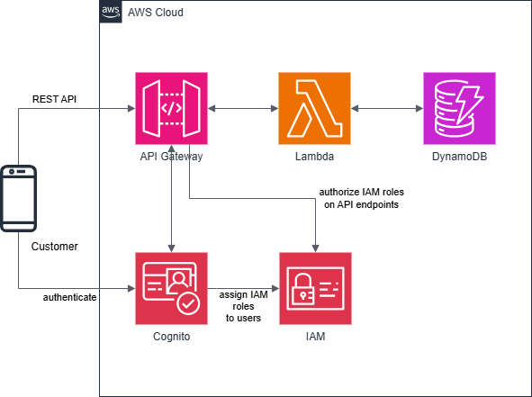
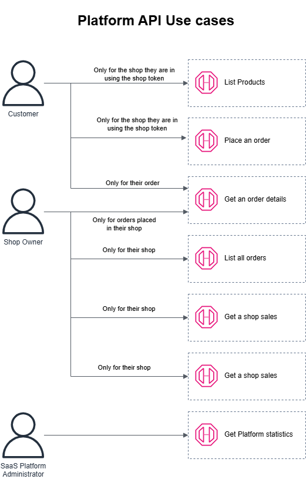
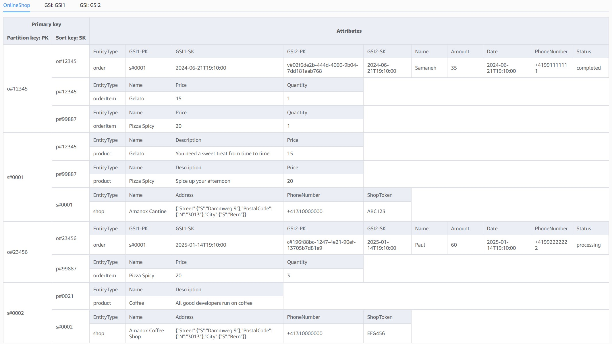

# AWS Challenge API Security

This repository contains the code for a demo to secure a SaaS shopping platform REST API on AWS.

This demo simulates the use case of a SaaS platform allowing different shop owners to sell their products to registered or visiting customers.
- Every customer can see the products and place an order at the shop they are in. To check that a customer is in the shop, in this demo we simulate a regularly rotated *shop token* (which customer could get by using a QR code - not implemented here) which must be provided by the customer client application when using the platform API. The *shop token* serves as a proof that the customer is in the shop.
- Every customer is able to only see their own orders. A visitor customer should be able to see their order status as long as the application caches the session sookie. A registered customer should be able to see all their historical orders.
- Every shop owner is only able to see their own shop and products, orders and sales.
- An administrator of the SaaS platform should only be see the overall statistics of the platform.

## Table of Contents
- [Technical Overview](#technical-overview)
    - [Demo Architecture](#demo-architecture)
    - [API Definition & Usages](#api-definition--usages)
    - [Authentication & Authorization](#authentication--authorization)
    - [Lambda Functions](#lambda-functions)
    - [DynamoDB Table Structure](#dynamodb-table-structure)
- [Deployment](#deployment)
- [Cognito Authentication](#cognito-authentication)
    - [Guest User Authentication](#guest-user-authentication)
    - [User Pool User Authentication](#user-pool-user-authentication)
- [Testing API Gateway APIs with Postman](#testing-api-gateway-apis-with-postman)
- [License](#license)

## Technical Overview

### Demo Architecture


To handle both all registered and visitor customers, shop owners and platform administrator, this infrastructure uses both a Cognito User Pool and an Identity pool.

The demo:
- creates automatically test users in the Cognito User Pool with a login passowrd saved in a Secrets Manager secret (see [User Pool User Authentication](#user-pool-user-authentication)).
- pre-populates the DynamoDB with two shops (IDs 0001 & 0002) with two products each and 1 order for each registered test customer in each shop.

### API Definition & Usages



The API is defined using the OpenAPI specification. The definition can be found in the YAML file located at `resources/openapi/api-definition.yaml`. Each API endpoint has a corresponding Lambda function that performs the endpoint action and interacts with the DynamoDB table.

See the OpenAPI definition [here](https://petstore.swagger.io/https://github.com/amanoxsolutions/api-security-demo/resources/openapi/api-definition.yaml)

### Authentication & Authorization

To implement the API security controls described above, a combination of
- IAM Roles
- Cognito User Pool
- Cognito Identity Pool
- API Gateway REST API endpoint authorization is set as `AWS_IAM`
- Filtering of data inside Lambda Functions

is used in the demo.

#### IAM Roles
Four IAM Roles are created for the different type of users:
- Visitor users: `api-security-demo-IdentityPool-UnauthenticatedRole`
- Registered users with an account on the platform: `api-security-demo-IdentityPool-AuthenticatedDefaultRole`
- Shop owners: `api-security-demo-IdentityPool-ShopOwnerRole`
- SaaS platform engineers: `api-security-demo-IdentityPool-AdminRole`

Each of these roles is attached IAM Policy allowing to invoke the API endpoint based on the [above API definition](#api-definition--usages).

For example `api-security-demo-IdentityPool-UnauthenticatedRole` and `api-security-demo-IdentityPool-AuthenticatedDefaultRole` for visitors and registered customers are attached the following policy:
```
{
    "Version": "2012-10-17",
    "Statement": [
        {
            "Action": "execute-api:Invoke",
            "Resource": [
                "arn:aws:execute-api:<REGION>:<ACCOUNT ID>:<API GATEWAY ID>/prod/GET/order/*",
                "arn:aws:execute-api:<REGION>:<ACCOUNT ID>:<API GATEWAY ID>/prod/GET/products",
                "arn:aws:execute-api:<REGION>:<ACCOUNT ID>:<API GATEWAY ID>/prod/POST/order"
            ],
            "Effect": "Allow"
        }
    ]
}
```

#### Cognito User Pool
A Cognito User Pool is created to store account information for registered customers, shop owners and platform administrators.
Registered users have 2 custom attributes:
- `custom:role` - to identify the role of the user. Values in this demo can be `shop_owner`, `customer` and `admin`
- `custom:shopId` - for users with the role `shop_owner` only, this identifies the ID of their shop. E.g. `0001`

#### Cognito Identity Pool
This is used to authenticate and authorize the users and where most of the magic happens to restrict access users.

The Identity Pool is configured with the User Pool as the identity provider to authenticate registered users with guest access allowed.

##### Guest Access
Any user authenticating into the identity pool [without passing user pool credentials](#guest-user-authentication), is authorized as a guest and given permissions assigned to the `api-security-demo-IdentityPool-UnauthenticatedRole` IAM role.

For such guests, orders are stored in DynamoDB with the GSI2-PK ([see below](#dynamodb-table-structure)) set as their Identity Pool ID. This ID is valid on their application client as long as it caches their session information. This allows such visitors to see the status of their orders placed during their existing session.

##### Registered User Access
The identity pool is configured to assign different IAM roles based on the role described in their user `custom:role` attribute.
- `customer` -> `api-security-demo-IdentityPool-AuthenticatedDefaultRole`
- `shop_owner` -> `api-security-demo-IdentityPool-ShopOwnerRole`
- `admin` -> `api-security-demo-IdentityPool-AdminRole`

Customers, shop owners and platform administrator who authenticate into the identity pool [with their user pool credentials](#registered-user-access) are then assigned one of the above IAM Role, granting them the appropriate API access based on the valume of their `custom:role` attribute.

For registered customers, orders are stored in DynamoDB with the GSI2-PK ([see below](#dynamodb-table-structure)) set as their User Pool ID. This allows such customers to see the status of their current and past orders regardless of their identity pool session.

##### Lambda Function Filtering
When a Lambda function is triggered to answer an API call, the user has already been authorized. There are 2 things that are then handled by the Lambda functions.

1- Verifying shop tokens

For shop customers, the Lambda function must check that the customer is passing in the API call query string parameters a shop token which is valid for the shop the query is for. [Here](./resources/lambdas/list_products/main.py#L42) is an example for the `List Products` API.

2- Filtering user data

When a user (e.g. a shop owner) is making a request, the Lambda function must make sure that the data that are returned are filtered based on their ID.

The combination of those mechanisms ensure that:
- users only have access to the API endpoints they are entitled to use
- data are filtered for the users
- customers can only place and see their orders if they are physically in the shop

### Lambda Functions

The repository includes several Lambda functions that handle different API endpoints. The Lambda functions are located in the `resources/lambdas` directory. Here are the main Lambda functions:

- `get_order`: Retrieves order details by order ID. Implementation can be found in `resources/lambdas/get_order/main.py`.
- `get_sales`: Retrieves total sales amount by shop ID. Implementation can be found in `resources/lambdas/get_sales/main.py`.
- `get_service_stats`: Retrieves service statistics. Implementation can be found in `resources/lambdas/get_service_stats/main.py`.
- `list_orders`: Lists orders by shop ID. Implementation can be found in `resources/lambdas/list_orders/main.py`.
- `list_products`: Lists products by shop ID. Implementation can be found in `resources/lambdas/list_products/main.py`.
- `place_order`: Places a new order. Implementation can be found in `resources/lambdas/place_order/main.py`.
- `regenerate_shop_token`: It rotates the shop token which must be used by a customer when calling the APIs as a proof that they are in the shop.
- `prefill_table_with_testdata`: Prefills the DynamoDB table with test data. Implementation can be found in `resources/lambdas/prefill_table_with_testdata/main.py`.

__Lambda Unit Testing__

A basic structure has been created to facilitate unit testing of the Lambda functions. Using Poetry, you can create a Python 3.12 virtual environment with the necessary dependencies and run the tests. Follow these steps from the `resources` folder:

1. Install dependencies: `poetry install --with dev`
2. Run tests: `poetry run pytest`


### DynamoDB Table Structure

The DynamoDB table structure is illustrated in the following diagram:


## Deployment

> [!Note]
> The application stack is defined in `lib/app/app-stack.ts`, and the pipeline stage is defined in `lib/pipeline-stage.ts`.

To deploy this CDK project, follow these detailed steps:

1. **Prerequisites**:
    - Node.js (version 14.x or later)
    - AWS CLI (configured with your AWS credentials)
    - AWS CDK CLI (version 2.x)
    - Python 3.12
    - Poetry (for managing Python dependencies)
    - Docker (for Lambda packaging)

   **Ensure Docker is installed and running on your local machine.** Docker is required for packaging Lambda functions during the CDK deployment process.

   Configure your programmatic access to AWS for the CLI
    - Refer to this AWS documentation: [Authentication and access credentials for the AWS CLI](https://docs.aws.amazon.com/cli/latest/userguide/cli-chap-authentication.html)
    - If your AWS CLI is using a named profile instead of the default profile, specify this profile when issuing  AWS CLI & CDK commands using the `--profile <your profile name>` option or the AWS_PROFILE environment variable.


Before deploying, you need to bootstrap your AWS account for CDK. Run the following command:
   ```
   cdk bootstrap aws://ACCOUNT-NUMBER/REGION
   ```

Replace `ACCOUNT-NUMBER` with your AWS account number and `REGION` with your target region.

2. **Clone the repository**:
   ```
   git clone https://github.com/amanoxsolutions/aws-challenge-api-security.git
   cd aws-challenge-api-security
   ```

3. **Install project dependencies**:
   ```
   npm ci
   ```

4. **Configure the deployment settings**:
    - Open `bin/api-security.ts` and review the stack configuration.
    - Ensure the `env` property is set correctly for your target AWS account and region.
    - Update the `prefix`, `repoName`, and `codestarConnectionArn` properties as needed.
    - If necessary, modify the `branchName` (defaults to 'main').

    Stack properties
    | Property | Type | Required | Default | Description |
    |----------|------|----------|---------|-------------|
    | prefix | string | Yes | - | Prefix for resource naming |
    | codestarConnectionArn | string | Yes | - | ARN for connections to this repo. For detailed instructions, see [Creating a connection to GitHub in the AWS Developer Tools Console](https://docs.aws.amazon.com/dtconsole/latest/userguide/connections-create-github.html#connections-create-github-console)|
    | runtime | Runtime | No | PYTHON_3_12 | Lambda runtime environment |
    | removalPolicy | RemovalPolicy | No | DESTROY | Resource removal policy |
    | repoName | string | Yes | - | Source repository name |
    | branchName | string | No | 'main' | Source branch name |

5. **Build the project**:
   ```
   npm run build
   ```

6. **Deploy the CDK stack**:
   Use the following command to deploy the stack using the named AWS CLI profile:
   ```
   cdk deploy
   ```

   This command will deploy a CodePipeline which will depliy the application stack defined in `lib/app` folder.

7. **Clean up**:
    - Note that some resources (like S3 buckets) may require manual deletion before deleting the stack, if they contain data.
    - To remove the pipeline resources, run:
      ```
      cdk destroy
      ```
    - The command will only delete the pipline, not the resources deploy by the application CloudFormation stack. The delete the application ressources, go directly in CloudFormation and manually delete the corresponding stack.


**Important Notes**:
- Ensure you have the necessary permissions to create and manage the AWS resources defined in the stack.
- The deployment will incur costs in your AWS account. Review the resources being created and understand the associated costs.
- For security reasons, avoid committing any sensitive information (like AWS credentials) to the repository.

For more detailed information on the deployment process or to customize the deployment, refer to the `lib/api-security-stack.ts` and `lib/app/app-stack.ts` files.

## Cognito Authentication

This section describes how to authenticate with the Cognito Identity pool as a guest user and as a user pool user using the AWS CLI.

### Guest User Authentication

To authenticate as a guest user:

1. Get the Identity Pool ID from the AWS Console.

2. Use the AWS CLI to get credentials for the guest user:

   ```
   aws cognito-identity get-id --identity-pool-id YOUR_IDENTITY_POOL_ID --region YOUR_REGION
   ```

   This will return an IdentityId. Use this IdentityId to get credentials:

   ```
   aws cognito-identity get-credentials-for-identity --identity-id YOUR_IDENTITY_ID --region YOUR_REGION
   ```

3. The command will return temporary AWS credentials (AccessKeyId, SecretKey, and SessionToken) for the guest user.

### User Pool User Authentication

This stack creates 4 test users:

1. shop1owner: email address = shop1owner@axians.com, role: shop_owner
2. shop2owner: email address = shop2owner@axians.com, role: shop_owner
3. adminuser: email address = adminuser@axians.com, role: admin
4. registeredcustomer1: email address = registeredcustomer1@axians.com, role: customer

To authenticate as a user pool user:

1. All users have the same password which is automatically generated and stored in a Secrets Manager secret named `<stack prefix>-TestUSersPassword` (by default api-security-challenge-TestUSersPassword)

2. Get the User Pool ID and Client ID
```
YOUR_USER_POOL_ID=$(aws cognito-idp list-user-pools \
    --region eu-central-1 \
    --max-results 60 \
    | jq -r '.UserPools[].Id')
```
```
YOUR_IDENTITY_POOL_ID=$(aws cognito-identity list-identity-pools \
    --max-results 60 \
    --region $YOUR_REGION \
    | jq '.IdentityPools[].IdentityPoolId')
```
```
YOUR_CLIENT_ID=$(aws cognito-idp list-user-pool-clients \
    --user-pool-id $YOUR_USER_POOL_ID \
    --region $YOUR_REGION \
    | jq -r '.UserPoolClients[].ClientId')
```
3. Initiate authentication using the AWS CLI:

Replace YOUR_USERNAME with the email address from one of the test user (see the list above) and YOUR_PASSWORD by the password from Secrets Manager.

```
# Replace YOUR_PASSWORD
YOUR_PASSWORD=<yourpassword>
YOUR_USERNAME=registeredcustomer1@axians.com
YOUR_ID_TOKEN=$(aws cognito-idp initiate-auth \
    --auth-flow USER_PASSWORD_AUTH \
    --client-id $YOUR_CLIENT_ID \
    --auth-parameters USERNAME=$YOUR_USERNAME,PASSWORD=$YOUR_PASSWORD \
    --region $YOUR_REGION \
    | jq -r .AuthenticationResult.IdToken)
```
```
unset YOUR_PASSWORD
```
4. Use YOUR_ID_TOKEN to get an IdentityId:

```
YOUR_IDENTITY_ID=$(aws cognito-identity get-id \
    --identity-pool-id $YOUR_IDENTITY_POOL_ID \
    --logins cognito-idp.$YOUR_REGION.amazonaws.com/$YOUR_USER_POOL_ID=$YOUR_ID_TOKEN \
    --region $YOUR_REGION \
    | jq -r '.IdentityId')

 ```
5. Finally, get the credentials for the authenticated user:

```
YOUR_CREDS=$(aws cognito-identity get-credentials-for-identity \
    --identity-id $YOUR_IDENTITY_ID \
    --logins cognito-idp.$YOUR_REGION.amazonaws.com/$YOUR_USER_POOL_ID=$YOUR_ID_TOKEN \
    --region $YOUR_REGION)
```
6. This will return temporary AWS credentials (AccessKeyId, SecretKey, and SessionToken) for the authenticated user.(YOUR_USERNAME=registeredcustomer1@axians.com)

```
# Extract individual values
echo "ACESS KEY ID:" $(echo $CREDS | jq -r '.Credentials.AccessKeyId')
echo "AWS_SECRET_ACCESS_KEY:" $(echo $CREDS | jq -r '.Credentials.SecretKey')
echo "AWS_SESSION_TOKEN:"$(echo $CREDS | jq -r '.Credentials.SessionToken')
```
```
#Unset the credentials from the env variables
unset $YOUR_CREDS
```
You can use these temporary credentials to make authenticated requests to your API or other AWS services. Remember to handle these credentials securely and never expose them in client-side code or public repositories.

## Testing API Gateway APIs with Postman

After obtaining the temporary AWS credentials from the Cognito authentication process, you can use these credentials to test the API Gateway APIs using Postman. Here's how to set it up:

1. **Install Postman**: If you haven't already, download and install Postman from [https://www.postman.com/downloads/](https://www.postman.com/downloads/).

2. **Configure AWS Signature Version 4 Authentication in Postman**:
    - Create a new request in Postman.
    - In the Authorization tab, select "AWS Signature" from the Type dropdown.
    - Select "Request Headers" in the "Add authorization data to" dropdown
    - Fill in the following fields:
        - AccessKey: Enter the AccessKeyId from the temporary credentials.
        - SecretKey: Enter the SecretKey from the temporary credentials.
        - AWS Region: Enter your AWS region (e.g., us-east-1).
        - Service Name: Enter "execute-api" (without quotes).
        - Session Token: Enter the AWS session token from the temporary credentials

3. **Set up the request**:
    - Enter the API Gateway URL in the request URL field. You can find this URL in the AWS Console or the CDK stack outputs.
    - Select the appropriate HTTP method (GET, POST, etc.) based on the endpoint you're testing.


4. **Make the request**:
    - Click the "Send" button to make the request to your API.

Example: Testing the `/products` endpoint:

1. Set the HTTP method to GET.
2. Enter the full URL for the products endpoint with the required URL query string parameters ( (e.g., `https://your-api-id.execute-api.your-region.amazonaws.com/prod/products?shopToken=IOQ984&shopId=0001`).
3. Ensure the AWS Signature authentication is set up as described above.
4. Click "Send" to make the request.

Postman will automatically sign the request using AWS Signature Version 4 with the provided credentials, allowing you to test your secured API endpoints.

### Example Output from postman
Here is an example output from postman when invoking the get products API as a customer (registeredcustomer1@axians.com)
```
{
    "productsList": [
        {
            "description": "msgHFPtspq",
            "name": "Zztoj",
            "price": 110,
            "productId": "0011",
            "shopId": "0001"
        },
        {
            "description": "lCYrTJavQE",
            "name": "Dbrmk",
            "price": 120,
            "productId": "0012",
            "shopId": "0001"
        }
    ],
    "shopId": "0001"
}

```
Example invokation of orders API is forbidden for the customer(registeredcustomer1@axians.com). See the IAM role mapping [ Registered User Access](#registered-user-access)
```
https://gt4n9vo5yk.execute-api.eu-central-1.amazonaws.com/prod/shop/0001/orders

{
    "Message": "User: arn:aws:sts::645143808269:assumed-role/api-security-demo-IdentityPool-AuthenticatedDefaultRole/CognitoIdentityCredentials is not authorized to perform: execute-api:Invoke on resource: arn:aws:execute-api:eu-central-1:********8269:gt4n9vo5yk/prod/GET/shop/0001/orders"

}

```
Remember to update the credentials in Postman whenever they expire, as temporary credentials have a limited lifetime.

## License

This project is licensed under the Apache License 2.0. See the `LICENSE` file for details.
